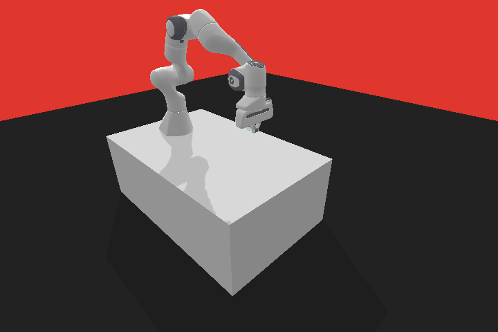
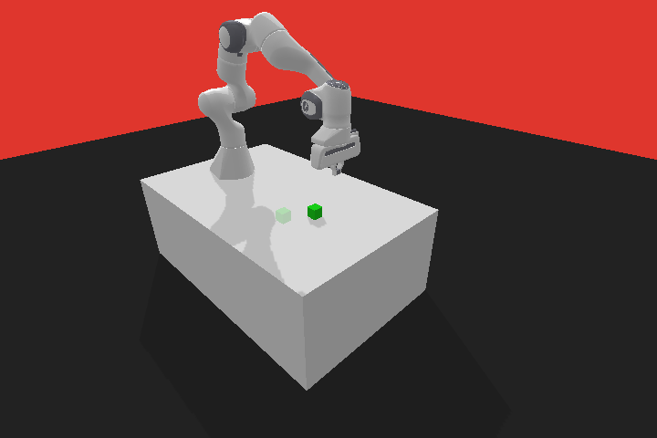
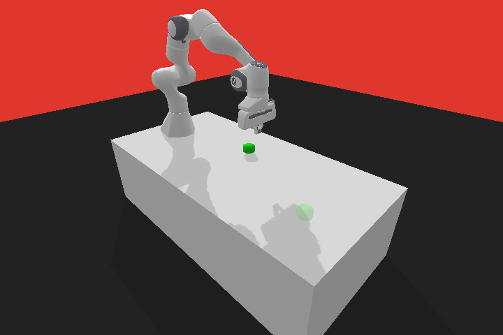
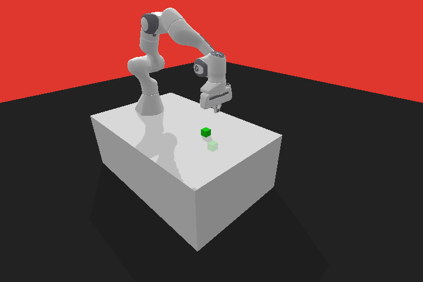

# panda-gym

Set of robotic environments based on PyBullet physics engine and gymnasium.

[](https://pypi.org/project/panda-gym/)
[](https://pepy.tech/project/panda-gym)
[](LICENSE.txt)
[](https://github.com/qgallouedec/panda-gym/actions/workflows/build.yml)
[](https://codecov.io/gh/qgallouedec/panda-gym)
[](https://github.com/psf/black)
[](https://arxiv.org/abs/2106.13687)

## Documentation

Check out the [documentation](https://panda-gym.readthedocs.io/en/latest/).

## Installation

### Using PyPI

```bash
pip install panda-gym
```

### From source

```bash
git clone https://github.com/qgallouedec/panda-gym.git
pip install -e panda-gym
```

## Usage

```python
import gymnasium as gym
import panda_gym

env = gym.make('PandaReach-v3', render_mode="human")

observation, info = env.reset()

for _ in range(1000):
    action = env.action_space.sample() # random action
    observation, reward, terminated, truncated, info = env.step(action)

    if terminated or truncated:
        observation, info = env.reset()

env.close()
```

You can also [](https://colab.research.google.com/github/qgallouedec/panda-gym/blob/master/examples/PickAndPlace.ipynb)

## Environments

|                                  |                                                |
| :------------------------------: | :--------------------------------------------: |
|         `PandaReach-v3`          |                 `PandaPush-v3`                 |
|  |                  |
|         `PandaSlide-v3`          |             `PandaPickAndPlace-v3`             |
|  |  |
|         `PandaStack-v3`          |              `PandaFlip-v3`                    |
|  |  |

## Baselines results

Baselines results are available in [rl-baselines3-zoo](https://github.com/DLR-RM/rl-baselines3-zoo) and the pre-trained agents in the [Hugging Face Hub](https://huggingface.co/sb3).

## Citation

Cite as

```bib
@article{gallouedec2021pandagym,
  title        = {{panda-gym: Open-Source Goal-Conditioned Environments for Robotic Learning}},
  author       = {Gallou{\'e}dec, Quentin and Cazin, Nicolas and Dellandr{\'e}a, Emmanuel and Chen, Liming},
  year         = 2021,
  journal      = {4th Robot Learning Workshop: Self-Supervised and Lifelong Learning at NeurIPS},
}
```

Environments are widely inspired from [OpenAI Fetch environments](https://openai.com/blog/ingredients-for-robotics-research/). 
