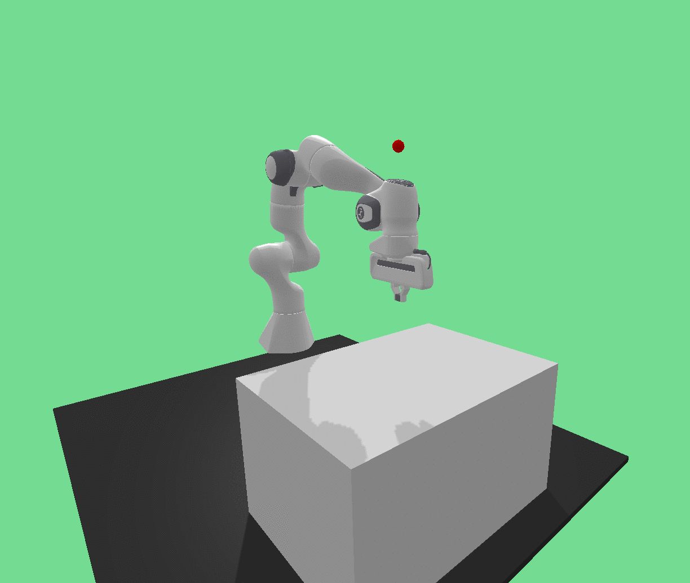
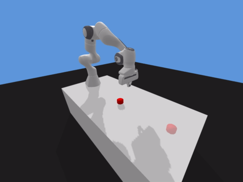
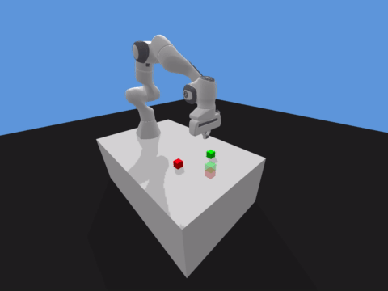

# panda-gym

**Under development**

[](https://pypi.org/project/panda-gym/)
[](https://pepy.tech/project/panda-gym)
[](LICENSE.txt)
[](https://github.com/qgallouedec/panda-gym/actions)
[](https://github.com/psf/black)

OpenaAI Gym Franka Emika Panda robot environment based on PyBullet.


## Installation

Using PyPI:

```bash
pip install panda-gym
```

From source:

```bash
git clone https://github.com/qgallouedec/panda-gym.git
pip install -e panda-gym
```

## Usage

```python
import gym
import panda_gym

env = gym.make('PandaReach-v1', render=True)

obs = env.reset()
done = False
while not done:
    action = env.action_space.sample() # random action
    obs, reward, done, info = env.step(action)

env.close()
```

## Environments

|                                  |                                                |
| :------------------------------: | :--------------------------------------------: |
|         `PandaReach-v1`          |                 `PandaPush-v1`                 |
|  |                  |
|         `PandaSlide-v1`          |             `PandaPickAndPlace-v1`             |
|  |  |
|         `PandaStack-v1`          |                                                |
|  |                                                |

Environments are widely inspired from [OpenAI Fetch environments](https://openai.com/blog/ingredients-for-robotics-research/). 