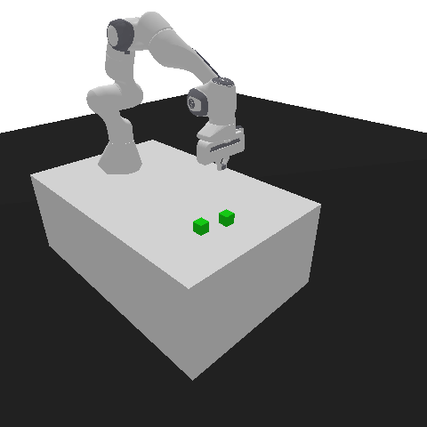

.. _advanced_rendering:

Advanced rendering
==================

Renderer
--------

There are two render modes available - ``"human"`` and ``"rgb_array"``. The ``"human"`` mode opens a window to display the live scene, while the ``"rgb_array"`` mode renders the scene as an RGB array.

When it comes to renderers, there are two options: OpenGL and Tiny Renderer. The OpenGL engine is used when the render mode is set to ``"human"``. However, when the render mode is set to ``"rgb_array"`` you have the choice between using either the OpenGL or Tiny Renderer engine. The Tiny Renderer can work in headless mode, but it may not produce as high-quality results as the OpenGL engine, particularly in regards to transparency, background and shadows. If headless mode is not a requirement, it is recommended to use the OpenGL engine. To do this, pass ``renderer="OpenGL"`` to the ``gymnasium.make`` function:

.. code-block:: python

    import gymnasium as gym
    import panda_gym

    env = gym.make("PandaReach-v3", render_mode="rgb_array", renderer="OpenGL")
    env.reset()
    image = env.render()  # RGB rendering of shape (480, 720, 3)
    env.close()

.. list-table::
   :widths: 50 50
   :header-rows: 1
   :align: center

   * - ``renderer="Tiny"``
     - ``renderer="OpenGL"``
   * - |tiny|
     - |opengl|

Viewpoint
---------

You can render from a different point of view than the default. For this, the following arguments are available:

- ``render_width`` (int, optional): Image width. Defaults to 720.
- ``render_height`` (int, optional): Image height. Defaults to 480.
- ``render_target_position`` (np.ndarray, optional): Camera targeting this position, as (x, y, z). Defaults to [0., 0., 0.].
- ``render_distance`` (float, optional): Distance of the camera. Defaults to 1.4.
- ``render_yaw`` (float, optional): Yaw of the camera. Defaults to 45.
- ``render_pitch`` (float, optional): Pitch of the camera. Defaults to -30.
- ``render_roll`` (int, optional): Roll of the camera. Defaults to 0.

Example
~~~~~~~

.. code-block:: python

    import gymnasium as gym
    import panda_gym

    env = gym.make(
        "PandaSlide-v3",
        render_mode="rgb_array",
        renderer="OpenGL",
        render_width=480,
        render_height=480,
        render_target_position=[0.2, 0, 0],
        render_distance=1.0,
        render_yaw=90,
        render_pitch=-70,
        render_roll=0,
    )
    env.reset()
    image = env.render()  # RGB rendering of shape (480, 480, 3)
    env.close()

